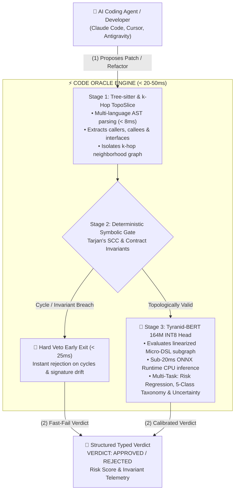

# Code Oracle

> In-memory patch verification for AI coding agents.  
> Deterministic AST topology via Tarjan SCC and sub-20ms semantic risk calibration via Tyranid-BERT (164M INT8).

[](https://opensource.org/licenses/Apache-2.0)
[](https://github.com/wahyuzero/code-oracle/actions/workflows/ci.yml)
[](https://pypi.org/project/code-oracle/)
[](https://pypi.org/project/code-oracle/)
[](https://huggingface.co/wxsys/tyranid-bert)
[](https://github.com/wahyuzero/code-oracle/releases/tag/v0.1.0)
[](#key-characteristics)
[](#key-characteristics)

---

## The Problem: Autoregressive Verification Overhead

When coding agents (Claude Code, Cursor, OpenCode, Codex) inspect code modifications, they face three operational bottlenecks:

1. **Confirmation Bias:** Generative models reviewing their own diffs frequently rationalize their own logic errors.
2. **Latency and Token Overhead:** Re-evaluating complete files through a frontier model introduces 2,000 to 6,000 ms of round-trip latency and consumes output tokens on conversational explanations.
3. **Tool Schema Bloat:** Standard MCP servers inject sprawling multi-tool schemas into the prompt context on every turn, reducing effective agent window capacity.

---

## Architecture

Code Oracle separates code generation from verification, running in-process as an offline gatekeeper.

Tree-sitter builds a localized AST graph from the diff. Tarjan's strongly connected components algorithm checks topological cycles and contract invariants symbolically. For structurally valid patches, Tyranid-BERT (a 164M parameter ModernBERT multi-task model quantized to INT8) scores semantic risk and multi-label taxonomy vectors in under 20 milliseconds on CPU.

### Verification Pipeline



---

## Key Characteristics

* **In-Memory Execution:** Evaluates diffs on local CPU via standalone ONNX Runtime. Latency runs under 8 ms for Stage 1-2 symbolic checks and under 20 ms for Stage 3 neural scoring.
* **Zero Token Overhead:** Returns structured status codes and calibrated probability vectors (`Pass`, `Fail`, `Risk Score`) without autoregressive text generation.
* **Minimal MCP Surface:** Exposes a single focused verification endpoint (`verify_patch`), saving agent context window tokens.
* **Fully Offline:** Operates without external API calls, cloud telemetry, or network access.

---

## Architectural Targets vs. Frontier LLM Review

| Metric | Autoregressive LLM Code Review | Code Oracle (Neuro-Symbolic) |
| :--- | :--- | :--- |
| **Response Latency** | 2,500 ms to 6,500 ms | **< 50 ms (Local In-Memory)** |
| **Output Token Cost** | 150 to 500 tokens / check | **0 tokens** |
| **Monetary Cost** | $0.003 to $0.02 / call | **$0.00 (Local / Offline)** |
| **Verification Method** | Probabilistic text generation | **Deterministic AST + Calibrated Score** |
| **Context Consumption** | Multi-KB schema injection | **Single-tool lean schema (< 100 tokens)** |

---

## Operational Scope and Boundaries

Code Oracle operates within explicit technical boundaries:

1. **Verification Only:** Code Oracle validates proposed edits against existing syntax and graph topology. It does not generate, autocomplete, or rewrite source code.
2. **Syntax Gate:** Proposed changes must parse into a valid Tree-sitter AST. Syntax errors fail at Stage 1 before invoking graph traversals or neural evaluation.
3. **Static Topology Focus:** Checks structural invariants, dependency cycles, and interface contracts. It complements rather than replaces integration test suites or dynamic runtime profilers.
4. **Hardware Footprint:** Requires ~150 MB of RAM for INT8 quantized inference via standalone `onnxruntime` on CPU. Zero PyTorch or GPU hardware required.

---

## Pretrained Model Weights

The fine-tuned **Tyranid-BERT (164M INT8)** multi-task decision head weights are hosted on Hugging Face:  
🤗 [**wxsys/tyranid-bert**](https://huggingface.co/wxsys/tyranid-bert)

Code Oracle automatically downloads and caches these weights to `~/.cache/code_oracle/weights/` on first invocation when `--neural` is enabled, or reads from local `./weights_base/` if present.

---

## Installation & Quickstart

### 1. Install via pip

```bash
# Core AST Symbolic Verification Engine (< 8ms, zero neural footprint)
pip install code-oracle

# With Tyranid-BERT ONNX Runtime decision model (< 20ms INT8 CPU)
pip install "code-oracle[neural]"

# Full developer setup with test suites & packaging tools
pip install "code-oracle[all]"
```

> [!NOTE]
> The core wheel is 142 KB and runs deterministic AST and Tarjan SCC verification with zero neural dependencies. The 145 MB Tyranid-BERT ONNX INT8 model is downloaded on-demand and cached to `~/.cache/code_oracle/weights/` on first execution with `--neural`.

### 2. FastMCP Server for Coding Agents

Run Code Oracle as an MCP sidecar for Claude Code, Cursor, or Antigravity:

```bash
code-oracle serve
```

### 3. CLI Verification & Analysis

```bash
# Verify proposed patch against current repository state
code-oracle verify --patch /path/to/patch.diff

# Incremental workspace symbol indexing
code-oracle index .

# Dead code & orphan symbol scan (0 in-degree reachability)
code-oracle dead-code .

# Static performance anti-pattern & resource leak audit
code-oracle perf-lint .

# Install Git pre-commit verification hook
code-oracle hook install
```

---

## Roadmap

- [x] Architecture Specification & Subgraph Slicing Design
- [x] TopoSlice AST Slicer & Incremental Workspace Indexer
- [x] Tarjan's SCC Cycle Detector & Deterministic Symbolic Gate
- [x] Multi-Task Risk Taxonomy (5 Classes) & Epistemic Uncertainty Estimation (ADR-0003)
- [x] Embedded Dead Code Semantics Classifier with ModernBERT Representations
- [x] Standalone ONNX Runtime Inference & Dynamic INT8 Quantization (`code-oracle export-onnx`)
- [x] Tyranid-BERT Official Model Release ([`wxsys/tyranid-bert`](https://huggingface.co/wxsys/tyranid-bert))
- [x] Golden Hybrid v3 Multi-Language Dataset (~4,900 balanced samples across Go, Python, TypeScript, Rust)
- [x] Lean FastMCP Server interface (`verify_patch`)
- [x] Agentic `SKILL.md` distribution for Claude Code, Cursor, and Antigravity
- [x] Git pre-commit & pre-push verification hook with unblock toggle (`code-oracle hook`)
- [x] Multi-language AST extractors for Tier 1 languages (Python, TypeScript, Go, Rust)
- [x] Dead Code & Orphan Symbol Scanner (`code-oracle dead-code` via 0-in-degree graph reachability)
- [x] Static Performance Anti-Patterns & Resource Leak Detector (`code-oracle perf-lint`: nested loop complexity, unclosed handles)
- [x] Official Git Tagging & GitHub Release pipeline (`v0.1.0`)
- [x] Python Package Wheel Distribution & PyPI Publishing (`pip install code-oracle`)
- [ ] Multi-Agent Ecosystem Integrations (Claude Code, Cursor, Antigravity, OpenCode, and Cline sidecars)

---

## License & Attribution

Distributed under the **Apache-2.0 License**. See `LICENSE` for details.

**Architect & Maintainer:**  
Wahyu Febri Tamtomo ([@wahyuzero](https://github.com/wahyuzero))  
Founder of [frugaldev.biz.id](https://frugaldev.biz.id) (Radical AI Efficiency & Frugal Computing).
